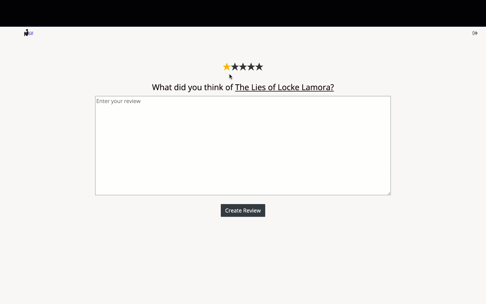

# GreatReads
For full accessibility, please log in:

Check it out [Live](https://great-reads-nick-galluzzo.herokuapp.com/)

## Description

GreatReads is a book cataloging web application that allows users to browse, review, and add popular books to their bookshelves. `Rails` and `PostgreSQL` were used to build the back-end. The front end was built using `React.js`, `Redux`, and `JavaScript`. All pages are fully responsive and dynamic depending on if the user is logged in or browsing as a guest.

### Features and Implementation

User Welcome


#### Browse
Upon loading GreatReads, users and guests are given the option to browse books by genre. Each book has one genre and each genre has many books. 


````
constructor(props) {
      super(props);
      this.state = {
        selectedGenre: 'all'
      };
    };
````

In order for books to be populated by genre, the Redux state populates all genres on component mount and the React state tracks the selected book genre. On load, the genre is set to list all books. 

````
renderGenres() {
  ...
    return (
      allGenres.map((genre) => {
       ...
       return <li onClick={() => this.handleClick(genre.name)} className={this.setSelected(genre.name)}>{upcaseGenre}</li>
       ...
      })
    )
````

When a user clicks through the different genres, the React state is updated and the books are concurrently displayed. This use of the React state allows the genres to be populated without a full page refresh.

### Book Show
The user routes to the book show page by clicking on a book. From the Book show page, they can see the average rating of the book from the cumulation of past GreatReads user reviews, add books to their bookshelves, read the book and author description, browse through other books the author has written, check out similar authors, discover similar books within the same genre, and read or write reviews. 

*(the gif below may take a second to play)*


I chose to make the add to shelf option a dropdown menu to make it more challenging.

The dropdown form compiles all of the user's bookshelves and lists the options.

`selectedOption: null`

The shelf form container passes awareness of the selectedOption to the shelf components through the react state. The shelf components update their background color if the submission is successful in the redux state without page re-load.

````
  componentDidUpdate(prevProps, prevState) {
    if (prevProps.shelves !== this.props.shelves) {
      const shelf = this.state.selectedShelf;
      this.setState({[shelf + 'Shelf']: true });
    }
  }
````

On component mount, if the book is in a user's shelf, the React state is updated and the appropriate style is displayed.

````
renderShelfState(shelfName) {
  ...
  const currentShelf = this.props.shelves.find((shelf) => shelf[shelfName])[shelfName]
  const currentBook = currentShelf.books.find((book) => this.props.book.id === book.id)
    if (currentBook) {
      this.setState({[shelfName + 'Shelf']: true})
     }
    ...
 }
````

### Reviews
Users can write one review per book and give ratings for books which appear instantly on the book show page by through updating the redux reviews state.



### User Bookshelves
Users can navigate to their bookshelves to browse all books that are saved in each individual shelf.


### Future Directions
* Search
* Improve author page
* Follow authors and friends
* Create reading groups with friends


